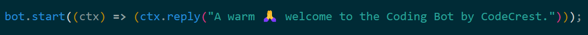
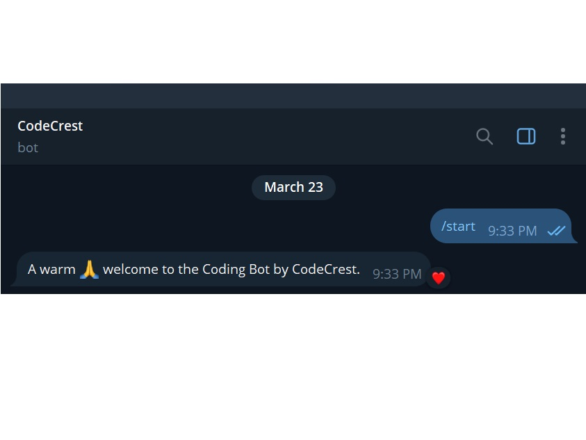
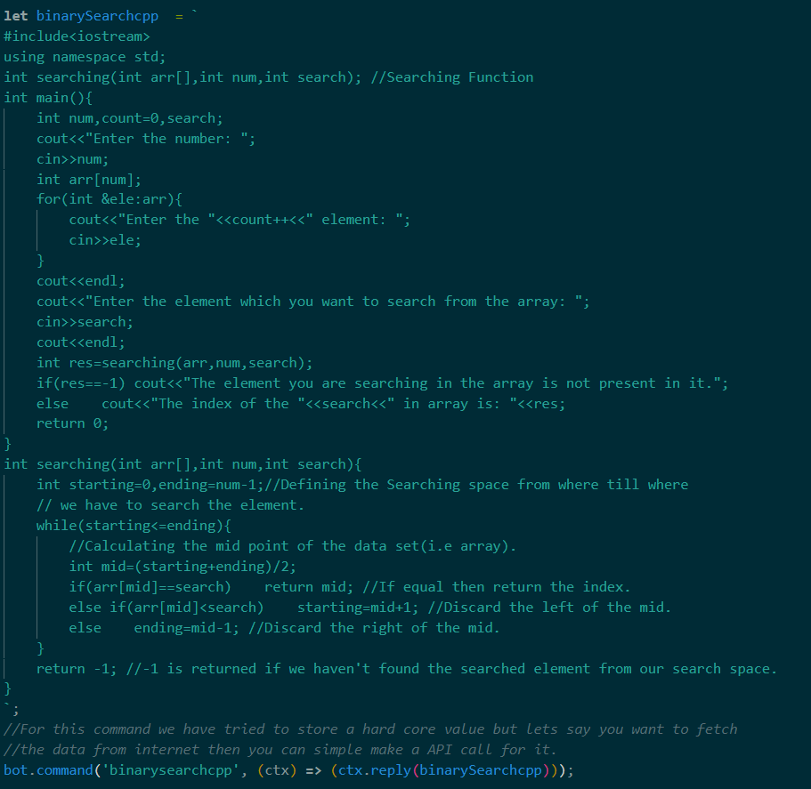
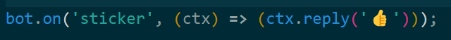
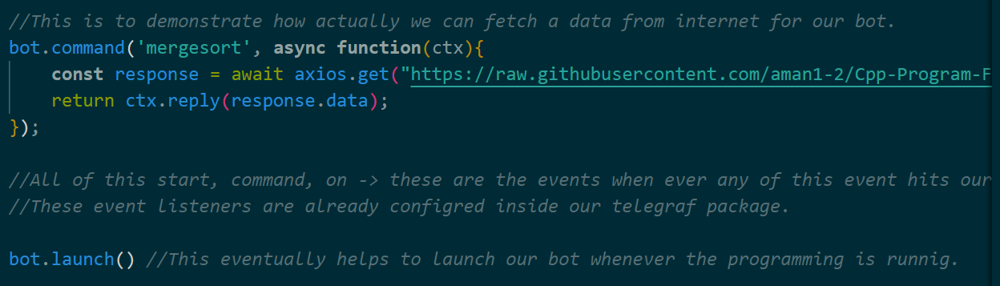
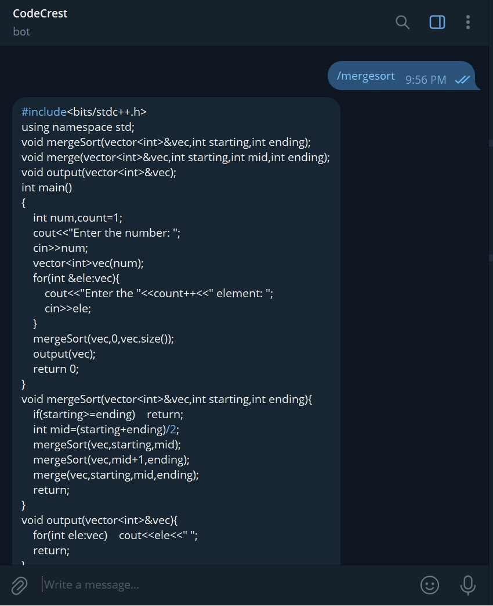
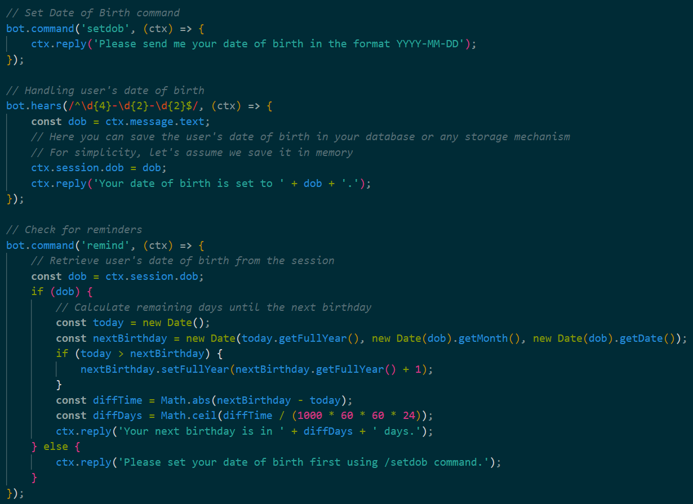
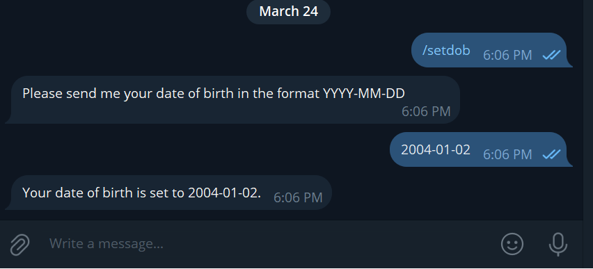
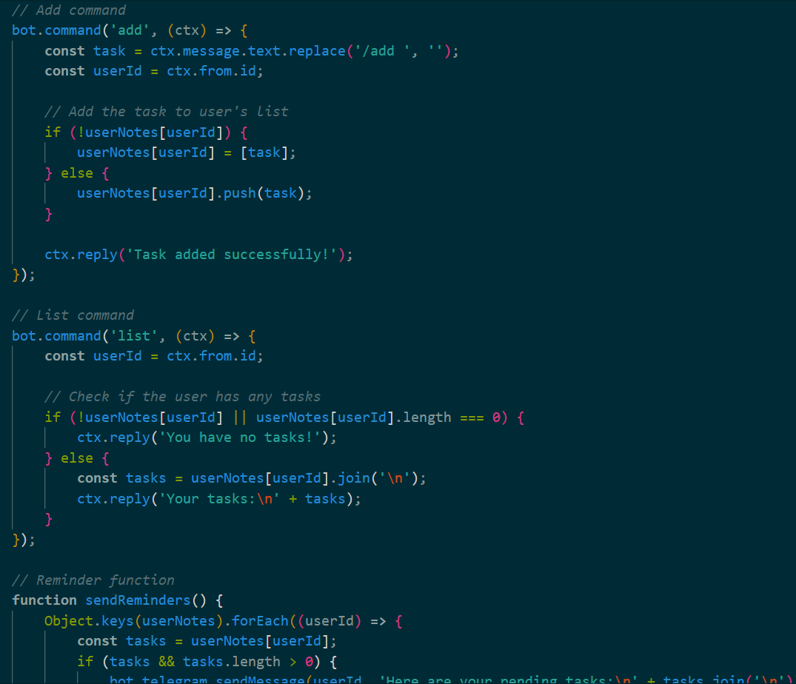
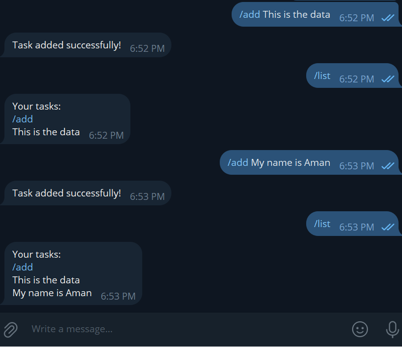

# Telegram Bot
- If you are new to the `Javascript` and `Nodejs` and just know completed with the async functions and call back functions with this bear minimum knowledge creating a telegram bot would be good to go and easy to do task with leass code and thatto becomes more easy if you use a thrid party package which can make your life even simpler.

---

- Before starting with your bot Program you find need to `create` a token for your bot.

**Steps For Creating a Token for Bot:-**
1. Open telegram and search for botfather.
2. To read instructions type /start and press enter.
3. To create a new bot type /newbot and press enter.
4. It will ask for a bot name, give a bot name without a slash. E.g:coding
5. Then it will ask for a username ending with the bot. E.g:coding_bot

---

# [CodeCrest] Manual

Welcome to the manual for [Your Telegram Bot Name]! This guide will help you understand how to use the bot effectively and make the most out of its features.

## Getting Started

1. **Start Command**
   - To start interacting with the bot, simply send the `/start` command.

2. **Set Date of Birth**
   - Use the `/setdob` command to set your date of birth in the format `YYYY-MM-DD`.

3. **Add Tasks**
   - Use the `/add <task>` command to add a new task to your to-do list.

4. **List Tasks**
   - Use the `/list` command to view your current list of tasks.

## Features

- **Date of Birth Reminder**
  - The bot will remind you about your upcoming birthday.

- **To-Do List Management**
  - Keep track of your tasks by adding them to your to-do list.

- **Task Reminders**
  - Get reminders about incomplete tasks every hour.

## Commands

- `/start` - Start interacting with the bot.
- `/binarysearchcpp` - Gives the output of binary search code in cpp
- `/mergesort` - Gives the output of merge sort code in cpp by fetching it throw internet.
- `/setdob` - Set your date of birth.
- `/add <task>` - Add a new task to your to-do list.
- `/list` - View your current list of tasks.
- `/remind` - Check how many days are left until your next birthday.

## Examples

1. To get the answer of few programs stored in it:

        /binarysearchcpp
        /mergesort

3. Setting Date of Birth:

        /setdob 2004-01-02

4. Adding a Task:

        /add Add your task

6. Viewing Tasks:

        /list

## Code snippet for writing a start command for your bot.

### 1.)Syntax for Starting the Bot -

*Output->*

- There is a event start which when we hit starts our bot.

### 2.)Syntax for replying a command where we have hard saved the answer in a variable -

*Output->*

- Anything starting with a '\' slash inside the bot is taken or treated a command if cooresponding to that command if we have any reply associated to it then its provided otherwise ignore.
    On the other hand if we have a any sentence starting without slash '\' then its considered as a plane chat-text.

### 3.)Syntax for Replying to any sticker you send -

*Output->*

### 4.)Syntax for replying a command where it fetches the answer from an API -

*Output->*

### 5.)Syntax for setting a reminder for the date-of-birth.

*Output->*

### 6.)Syntax for storing some notes on your bot.

*Output->*

---

## Feedback

We value your feedback! If you have any suggestions, questions, or encounter any issues with the bot, please feel free to contact us.

## Support

If you need further assistance or have any inquiries, you can reach out to our support team at [support@example.com].
